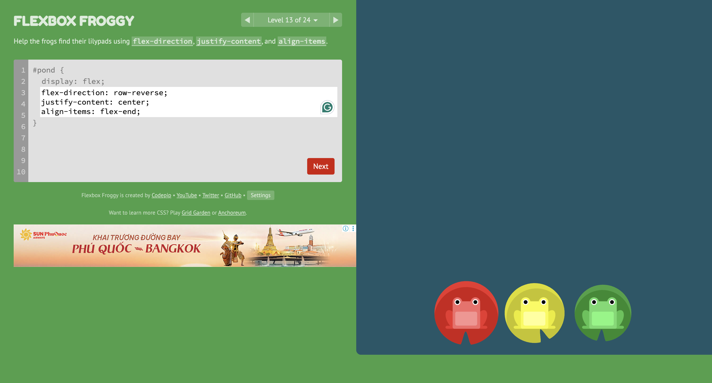

# Week NN Log

Week: 06/08 - 06/10

> **What this is**: a short weekly summary of what you built, learned, and how you used AI. Not a diary — just structured evidence of your work.
>
> **Format**: use proper Markdown — headings, bullet points, code blocks. This file will be rendered on GitHub. If it looks like plain text with no formatting, you're doing it wrong.
>
> **Required**: all 4 sections present and non-empty. Empty sections = incomplete log.

## What I worked on

MP1's proposal and PRD
I played flexbox froggy to practice my skills on flexbox properties.

## What I learned

<!--
justify-direction, flex-direction, align-items

eli5 = simple recap
try to use em instead of px because its a scale factor
use POST for sensitive information instead of GET
essential attributes of a form: action (where data is sent), method (get or post)
-->

-

## AI interactions

<!--
One block per interaction. Add more as needed.
-->

### Interaction 1

- **What I asked**: I asked "Read my PRD.md and PROPOSAL.md. Build the first version of my Mini Project 1 website for Christine Le's noodle shop guide. (then gave it a bunch of requirements I won't paste in here to keep format clean)
  Please create all necessary files and explain briefly what each file does."
- **What AI gave me**: In my request, I asked it to create 4 different pages: index.html, about.html, contact.html and pricing.html which it did almost perfectly.
- **What I kept / changed / rejected**: I kept almost everything regarding it's recommendations for the website's structure, navigationg and content organization and got rid of recommendations for advanced features such as payments, etc. because I think that is too complex and no yet needed at the moment.

## Questions

<!--
Things you're confused about, want to explore, or want help with.
As many as you have.
-->

-
